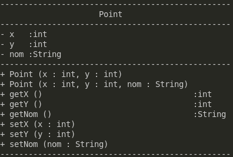

# SAE-3_01



## Presentation

Outil de représentation de diagrammes UML

Une fois lancé, dans un dossier ou sur un fichier

Le code génère une représentation en UML CUI des classes avec 

- Les associations
- Les implementations 
- Les héritages


## Structures des dossiers

The workspace contains two folders by default, where:

- `src`  Dossier des codes java
- `lib`  Dossier des librairies

Le fichiers class seront générés dans un dossier `class`

## Dépendances

- `Make` : Pour lancer le MakeFile 
- `Java` : Evidemment

## Comment démarrer
Sur Linux
```sh
chmod u+x start.sh
./start.sh
```
Sur Windows
```sh
./start.bat
```
Avec le Makefile
```sh
make build
make run
```

Try to run make build once, it's safer